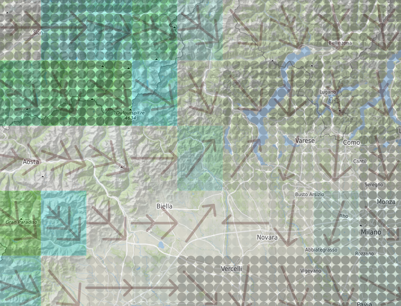

# SoaringMeteo

https://soaringmeteo.org is a weather forecast website for soaring
pilots.

This repository contains the implementation of the new version of
the website.

# Architecture

On the one hand, SoaringMeteo produces weather forecast data
relevant for soaring pilots. This data is produced either by
extracting it from third-party sources such as [GFS], or by running
the [WRF] model on our own servers.

On the other hand, this forecast data is displayed on the website
https://soaringmeteo.org.

This repository contains two sub-projects:

- [backend](backend/), which produces the forecast data,
- [frontend](frontend/), which displays the forecast data.

The backend part is made of three distinct programs:

- `gfs`, the GFS pipeline, which processes data from the GFS model
- `wrf`, the WRF pipeline, which processes data from the WRF model
- `common`, common parts (e.g., GRIB extraction, etc.)

Please refer to each sub-project for more details.

# Usage

Go to https://soaringmeteo.org/v2.

# License

[GPL-3.0-or-later]

[GFS]: https://www.ncdc.noaa.gov/data-access/model-data/model-datasets/global-forcast-system-gfs
[WRF]: https://www2.mmm.ucar.edu/wrf/users/
[open issues]: https://github.com/soaringmeteo/soaringmeteo/issues
[GPL-3.0-or-later]: https://choosealicense.com/licenses/gpl-3.0/

# Contributing

Pull requests are welcome. See the [CONTRIBUTING.md](CONTRIBUTING.md) file for more details, or the [TRANSLATING.md](./TRANSLATING.md) file if you want to help translate the user interface.

# Donating

As you may know, Jean Oberson originally paid for the development and operation of this site (and we appreciate that). To ensure the long term viability we are request donations to cover the operational costs. CSM membres contributing to the site or administering the club give their time free of charge. We prefer direct donations as opposed to other forms of financing such as advertising.

Each year we look for funds to pay for the web and computing servers (for WRF + GFS calculations and the website). The budget is approx. 1'500 CHF (1350.- €) per year.

We promise to continue to publish the CSM annual accounts on this website. So, we ask you to consider a donation however modest. Each donaton encourages us to further develop the site - we thank you in advance.

