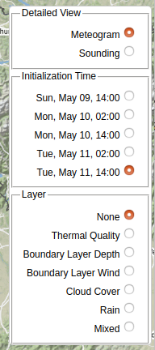
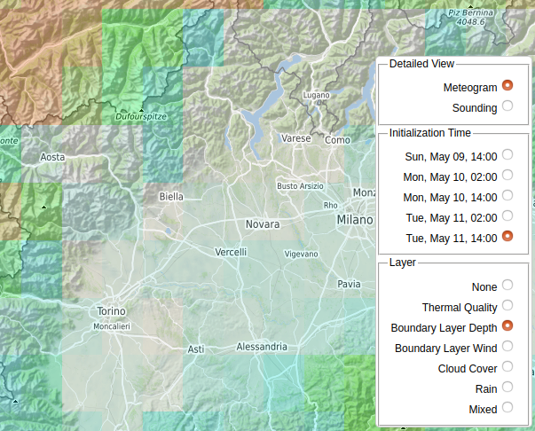
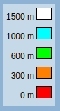
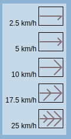
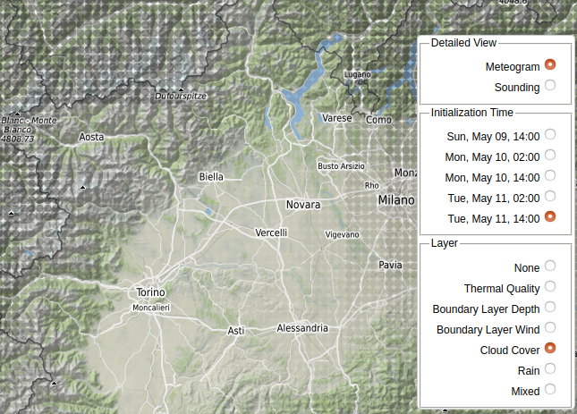
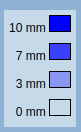
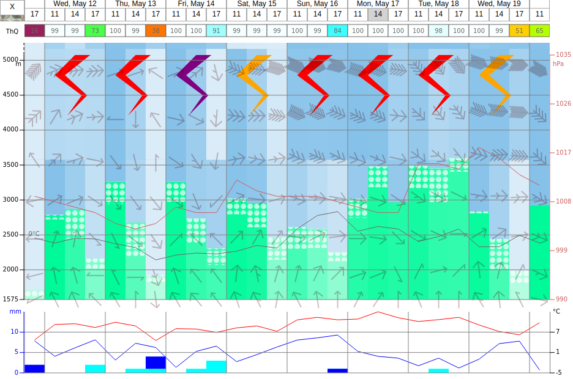
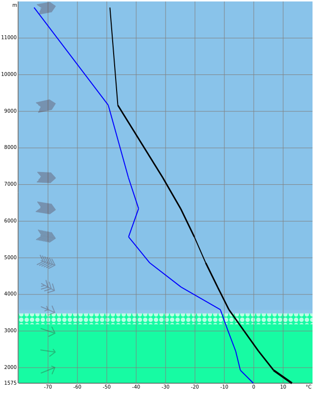

# SoaringMeteo

https://soaringmeteo.org is a weather forecast website for soaring
pilots.

This repository contains the implementation of the new version of
the website.

## Architecture

On the one hand, SoaringMeteo produces weather forecast data
relevant for soaring pilots. This data is produced either by
extracting it from third-party sources such as [GFS], or by running
the [WRF] model on our own servers.

On the other hand, this forecast data is displayed on the website
https://soaringmeteo.org.

This repository contains two sub-projects:

- [backend](backend/), which produces the forecast data,
- [frontend](frontend/), which displays the forecast data.

Please refer to each sub-project for more details.

## Contributing

Pull requests are welcome. See the [open issues].

## Usage

Go to https://soarwrf1.soaringmeteo.org/v2.

Select a forecast period at the top of the window:

The first row shows days, and the second row shows hours in the days.

Alternatively, change the forecast period by clicking on the buttons at the bottom of the window:

At the bottom-right of the window, move the mouse pointer over the layers icon to select the information to display:

The “Detailed View” part is explained below. The “Initialization Time” part allows you to switch to a different run of the forecast, which can be useful to compare how the forecast evolved over time for a specific location and time. The “Layer” part allows you to select what to display over the map.

The “None” overlay just displays the map.

The “Thermal Quality” overlay shows an indicator of thermal quality:

The thermal quality is a single indicator that takes into account the boundary layer depth, the average wind speed within the boundary layer, and the total cloud cover. It uses the following color scale (100% means a high chance of finding good thermals):

The “Boundary Layer Depth” overlay shows the boundary layer depth:

It uses the folowing color scale:

The “Boundary Layer Wind” overlay shows the average wind speed and direction within the boundary layer:

The wind flows in the direction of the arrows, and the number and length of barbells model the wind speed:

The “Cloud Cover” overlay shows the total cloud cover:

The darker the dots, the more important the cloud cover is:

The “Rain” overlay shows the amount of rainfalls:

The more opaque, the more rainfalls:

By default, the application shows the “Mixed” overlay, which combines three layers: the boundary layer depth, the boundary layer wind, and the cloud cover:

It uses the same color scales as the individual overlays:

  

Look for areas that are white (high boundary layer depth), with a thin wind arrow (little wind), and no dark points (clear sky).

By clicking on a specific point on the map, you will see a detailed view for this location. You can display either a meteogram, or a sounding.

The meteogram shows the weather forecast for this location, over time:

The first row shows the “thermal quality” indicator at this location, for each time period.

Then, there are two diagrams. The first one shows the boundary layer height (green columns, scale on the left in meters), the wind speed and direction at several elevation levels, and the low, middle, and high cloud cover (the whiter, the more covered). The white dots indicate cumuli clouds. The red line shows the atmospheric pressure (scale on the right in hPa), and the black line shows the zero degree isotherm.

The bottom diagram shows rainfalls (blue bars and cyan bars, scale on the left in millimeters). The red line shows the air temperature at the ground level (scale on the right in Celsius degrees), and the blue line shows the dew point temperature.

Soundings show the air temperature lapse rate at the given location, for the selected forecast period:

The black line shows the evolution of the temperature (horizontal axis) of the air with altitude (vertical axis). A thin line means a stable air mass. The thicker the line, the more unstable the air mass is.

The blue line shows the evolution of the dew point temperature with altitude.

The green area shows the boundary layer height. The white dots model cumuli clouds.

On the left, the wind speed and direction is shown at various altitude levels by the wind barbells.

## License

[GPL-3.0-or-later]

[GFS]: https://www.ncdc.noaa.gov/data-access/model-data/model-datasets/global-forcast-system-gfs
[WRF]: https://www2.mmm.ucar.edu/wrf/users/
[open issues]: https://github.com/soaringmeteo/soaringmeteo/issues
[GPL-3.0-or-later]: https://choosealicense.com/licenses/gpl-3.0/
