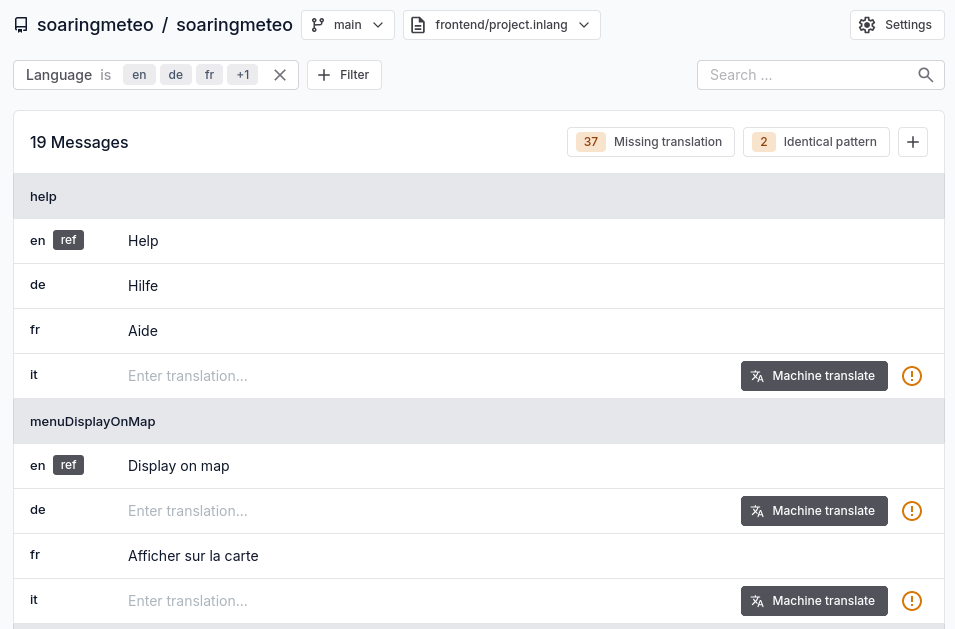
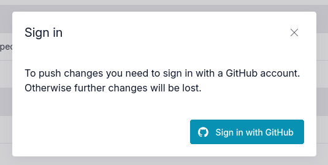
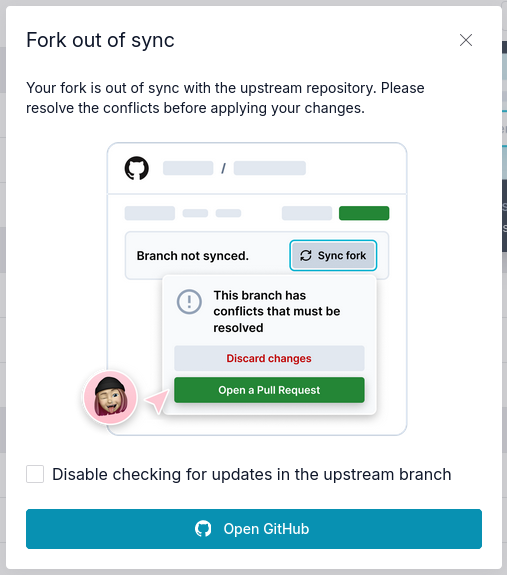
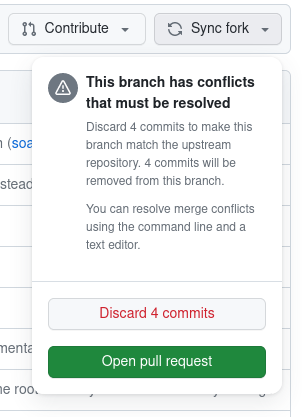
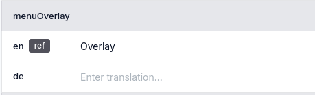
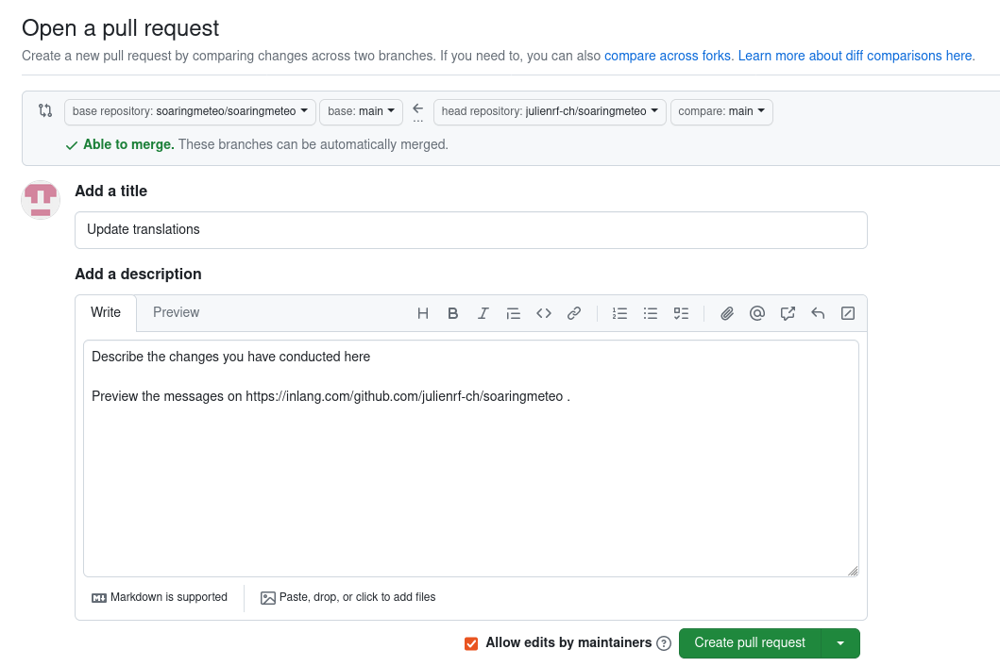

# How to translate

The user interface is available in several languages. Your help is welcome to support another language, or to fix or complete the existing translations. The reference language is English.

## Prerequisites

To contribute translations, you first need to create a [GitHub](https://github.com) account (this is free).

## Tools

Translations are managed by online tools (Fink and GitHub), which means that you will not have to install anything besides a web browser.

You can track the status of each supported language here: https://fink.inlang.com/github.com/soaringmeteo/soaringmeteo.

The Fink tool displays all the messages used by the Soaringmeteo user interface, and their status in the supported language. On the screenshot, we see two messages (with identifiers `help` and `menuDisplayOnMap`) and their translations in the supported languages. Each language is identified by its country code (e.g. `en` for English, `fr` for French, etc.). In front of each language, you can see the translated message, or a placeholder in case the translation is missing.

## Fix or complete an existing translation

1. Go to the overview or “missing translations” page for your target language.
   - French:
     - [overview](https://fink.inlang.com/github.com/soaringmeteo/soaringmeteo?project=%2Ffrontend%2Fproject.inlang&lang=en&lang=fr)
     - [missing translations only](https://fink.inlang.com/github.com/soaringmeteo/soaringmeteo?project=%2Ffrontend%2Fproject.inlang&lang=en&lang=fr)
   - German:
     - [overview](https://fink.inlang.com/github.com/soaringmeteo/soaringmeteo?project=%2Ffrontend%2Fproject.inlang&lang=en&lang=de)
     - [missing translations only](https://fink.inlang.com/github.com/soaringmeteo/soaringmeteo?project=%2Ffrontend%2Fproject.inlang&lint=messageLintRule.inlang.missingTranslation&lang=en&lang=de) 
2. At the bottom of the page, click to “Sign In” to start making changes.

   
3. Log in to GitHub, and then accept to install and authorize the inlang app on your account.

   
4. If this is the first time you contribute, at the bottom of the page, click to “Fork” (this action is necessary only once).

   

   Otherwise, if you already have a fork, make sure to synchronize it with the upstream repository before you start translating. If you see a message that tells you your fork is out of sync, click to “Open GitHub”:

   

   And then, in GitHub, click “Sync fork” and “Discard X commits” if there are conflicts:

   

5. Fix any existing translated message, or translate any missing message.

   
6. When you are done with your changes, click to “Push” at the bottom of the page.

   
7. Submit your changes by clicking to “New pull request”.

   
8. You will be redirected to GitHub, where you will have to click to “Create pull request” to effectively submit your changes.

   

## Add support for another language

Please file an [issue](https://github.com/soaringmeteo/soaringmeteo/issues/new?assignees=&labels=&projects=&template=feature_request.md&title=Add+support+for+language+xx) to request the support of another language.
